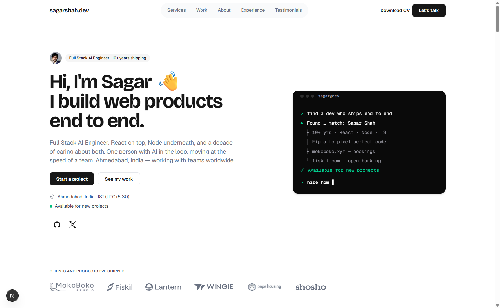

# sagarshah.dev

Personal site of Sagar Shah — full stack AI engineer in Ahmedabad, India.

**Live:** [sagarshah.dev](https://sagarshah.dev)



| | |
|---|---|
| Lighthouse (desktop) | **99** performance · **100** accessibility · **100** SEO |
| Lighthouse (mobile) | 86 performance · **100** accessibility · **100** SEO |
| Layout shift (CLS) | **0** |
| Client-side JavaScript | **3** small components in the whole site |
| Dependencies beyond React/Next | **6** |
| License | MIT |

## What makes it different

- **All styling lives in one file.** Every colour, font size, radius and shadow is defined in
  [`src/design/tokens.ts`](src/design/tokens.ts). If a style is written anywhere else, the
  build fails. Restyling the entire site means editing that one file — and a commit in the
  git history proves it: fonts, weights and surfaces were swapped without touching a single
  section file.

- **Almost no JavaScript in the browser.** The mobile menu, the FAQ accordion and the
  navigation highlighting all use built-in browser features instead of React code. Only
  three client components exist: the mobile nav, a copy button, and the error screen.

- **The build checks the copy.** A link to a section that doesn't exist fails the build.
  The day "over a decade of experience" stops being true, the build fails and says so —
  the words on the page can't quietly go stale.

- **Accessibility is measured, not assumed.** Colour-contrast numbers are recorded next to
  the colours they justify, and combinations that fail the standard are blocked — some of
  them by the type checker itself.

- **Minimal on purpose.** No UI library, no animation library, no state library. Decisions
  that were tried and rejected are written down in the code as comments, with the numbers
  that justified them.

## Built with

[Next.js 16](https://nextjs.org) · [React 19](https://react.dev) ·
[TypeScript](https://typescriptlang.org) · [Tailwind CSS v4](https://tailwindcss.com) ·
[Lucide](https://lucide.dev) icons

## Project layout

```
src/
├── content/     all the words on the page, in typed files
├── design/      tokens.ts — every style decision in the project
├── components/  building blocks → cards → page sections → the 3 client components
├── lib/         small helpers
└── app/         the page itself, plus icons, sitemap and social-preview image
```

To change what the site says, edit `src/content/`. To change how it looks, edit
`src/design/tokens.ts`. The two never mix.

## Running locally

```bash
git clone https://github.com/shahsagarm/sagarshah.dev.git
cd sagarshah.dev
npm install
npm run dev
```

Requires **Node 22.18 or newer**. One optional environment variable:
`GOOGLE_ANALYTICS_ID` (analytics only load when it is set).

| Script | What it does |
|---|---|
| `npm run dev` | Development server |
| `npm run build` | Production build |
| `npm run verify` | Every check plus the build — the single gate before shipping |

## Make it yours

MIT-licensed, so fork away. The build catches most mistakes for you:

1. **Content** — edit the files in [`src/content/`](src/content/). Dead links and stale
   dates fail the build on their own.
2. **Images** — replace the files in `src/assets/`; the CV PDF lives in `public/`.
3. **Restyle** — change [`src/design/tokens.ts`](src/design/tokens.ts) and the three font
   lines in `src/app/globals.css`. Nothing else to hunt down.
4. **Verify** — `npm run verify`. If it passes, ship it.

[`DESIGN.md`](DESIGN.md) is the full design spec. [`AGENTS.md`](AGENTS.md) briefs AI coding
agents on the house rules.

## Versions

- **v2** (this branch) — live at [sagarshah.dev](https://sagarshah.dev)
- **v1** — preserved on the [`v1` branch](https://github.com/shahsagarm/sagarshah.dev/tree/v1)
  and live at [v1.sagarshah.dev](https://v1.sagarshah.dev)

## License

Code is [MIT](LICENSE). The content is personal — copy, images, CV, client logos and
testimonials describe a real person and real work; please replace them with your own.
